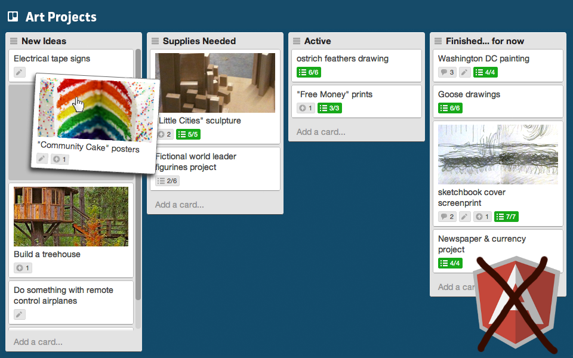
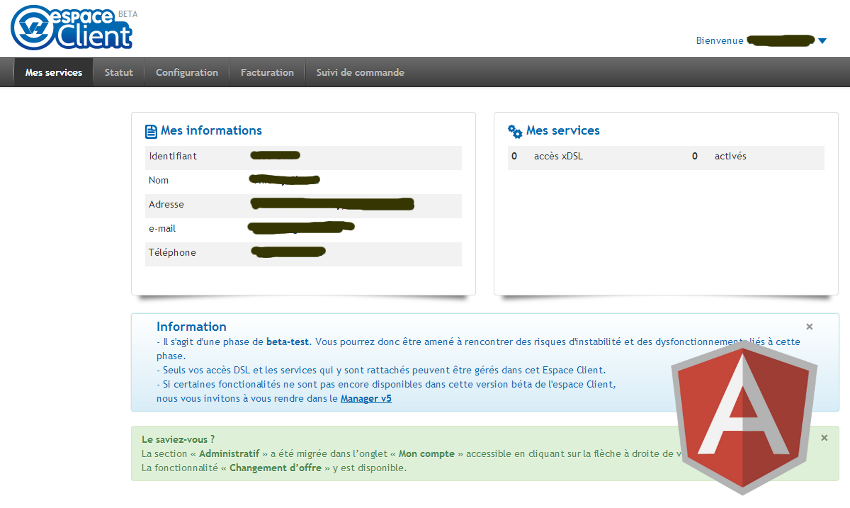

!SLIDE ============================

!SLIDE subsection =================

# Qu'est-ce qu'AngularJS ?

!SLIDE ============================

# framework JavaScript

### 43866 lignes de code JavaScript
### minified 77 KB

!SLIDE code small =======================

<pre>
AngularJS versions

Release Date    Version	    Codename
Jan 22, 2013    1.1.2	    tofu-animation
Jan 22, 2013	1.0.4	    bewildering-hair
Nov 26, 2012	1.1.1	    pathological-kerning
Nov 26, 2012	1.0.3	    bouncy-thunder
Aug 31, 2012	1.1.0	    increase-gravatas
Aug 31, 2012	1.0.2	    debilitating-awesomeness
Jun 25, 2012	1.0.1	    thorium-shielding
Jun 13, 2012	1.0.0	    temporal-domination
Jun 12, 2012	1.0.0rc12	regression-extermination
Jun 10, 2012	1.0.0rc11	promise-resolution
May 23, 2012	1.0.0rc10	tesseract-giftwrapping
May 14, 2012	1.0.0rc9	eggplant-teleportation
May 6,  2012	1.0.0rc8	blooming-touch
Apr 30, 2012	1.0.0rc7	rc-generation
Apr 20, 2012	1.0.0rc6	runny-nose
Apr 12, 2012	1.0.0rc5	reality-distortion
Apr 5,  2012	1.0.0rc4	insomnia-induction
Mar 29, 2012	1.0.0rc3	barefoot-telepathy
Mar 20, 2012	1.0.0rc2	silence-absorption
Mar 13, 2012	1.0.0rc1	moiré-vision
Jan 17, 2012	0.10.6	    bubblewrap-cape
Nov 8,  2011	0.10.5	    steel-fist
Oct 22, 2011	0.10.4	    human-torch
Oct 13, 2011	0.10.3	    shattering-heartbeat
Oct 8,  2011	0.10.2	    sneaky-seagull
Sep 9,  2011	0.10.1	    inexorable-juggernaut
Sep 2,  2011	0.10.0	    chicken-hands
Aug 20, 2011	0.9.19	    canine-psychokinesis
</pre>

!SLIDE ============================

<table>
 <tr>
  <td>  
  	  Miško Hevery</td>
  <td>   
  	  Vojta Jína</td>
  <td>  
  	  Igor Minar</td>
 </tr>
</table>
  

!SLIDE ============================

# _“HTML enhanced_
# _for web apps!”_

!SLIDE ============================

!SLIDE ============================

!SLIDE ============================

!SLIDE big ========================

# _HTML enhanced ?_

!SLIDE back =======================

# _HTML 6 ?_

!SLIDE ============================

!SLIDE subsection =================

# “only talk to your friends”

!SLIDE ============================

!SLIDE bullets top ====================

 

### *une méthode ne peut appeler de méthode que :*

!SLIDE bullets top ====================

 

### *une méthode ne peut appeler de méthode que :*

* de l'objet lui-même

!SLIDE bullets top ====================

 

### *une méthode ne peut appeler de méthode que :*

* de l'objet lui-même
* de ses arguments

!SLIDE bullets top ====================

 

### *une méthode ne peut appeler de méthode que :*

* de l'objet lui-même
* de ses arguments
* d'un objet qu'elle a créé

!SLIDE bullets top ====================
                                                                                                         
 

### *une méthode ne peut appeler de méthode que :*

* de l'objet lui-même
* de ses arguments
* d'un objet qu'elle a créé
* d'une propriété **_directe_** de l'objet

!SLIDE subsection =================

# limiter le couplage !

!SLIDE ============================

!SLIDE ============================
# “un seul point”
# xxx.yyy
# xxx.yyy.zzz

!SLIDE ============================
# prop.truc.methode()

!SLIDE ============================
# a = prop.truc
# a.methode()

!SLIDE ============================
# prop.truc().methode()
# ?

!SLIDE subsection =================

# encapsulation

!SLIDE ============================
# prop.getInterne().methode()

!SLIDE ============================
# prop.search().count()

!SLIDE ============================

!SLIDE subsection =================

# “tell, don't ask”

!SLIDE ============================
## client.portemonnaie.pieces -= 3

!SLIDE left =======================
## &nbsp;&nbsp;client.getPortemonnaie().setPieces(
## &nbsp;&nbsp;&nbsp;&nbsp;&nbsp;&nbsp;client.getPortemonnaie().getPieces() - 3)

!SLIDE ============================
## client.payer(3);

!SLIDE ============================

# déléguer des comportements
### pas des propriétés

!SLIDE ============================
## [*“Why getter and setter methods are evil”*](http://www.javaworld.com/javaworld/jw-09-2003/jw-0905-toolbox.html)
### by Allen Holub

!SLIDE subsection =================

# danger d'un objet “contexte”

!SLIDE ============================
## [*“Breaking the Law of Demeter is Like Looking for a Needle in the Haystack”*](http://misko.hevery.com/2008/07/18/breaking-the-law-of-demeter-is-like-looking-for-a-needle-in-the-haystack/)
### by Miško Hevery

!SLIDE code big ===================

    class Mechanic {
    
        Engine engine;

        Mechanic(Context context) {
            this.engine = context.getEngine();
        }
    }

!SLIDE back =======================

# “loi” : à relativiser

!SLIDE bullets ====================

# violations nécessaires

* {user.profile.name}
* si les données sont un ViewModel

!SLIDE subsection =================

# D D D

!SLIDE ============================

!SLIDE ============================

# agrégat

